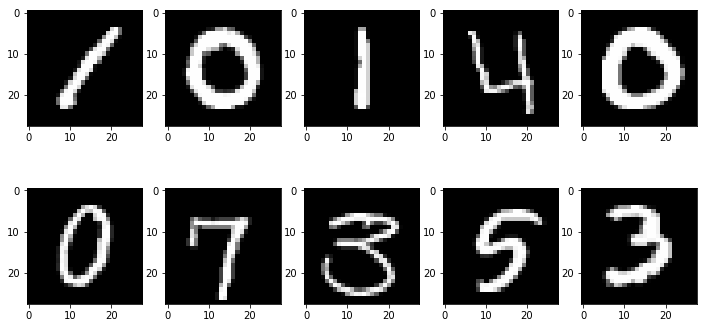

I have been playing around with the TensorFlow library and wanted to see if I could build an "operational" machine learning classifier.  The idea is to train a classifier on a dataset, then build a tool that can apply the classifier to new examples.  To do this I am using the MNIST digits dataset - a widely used machine learning dataset for classifying hand-drawn digits.

### The data & classifier
The input examples for the classifier are 28 x 28 pixels images of a single hand drawn digit, along with the corresponding true classification.  Here's what they look like:

The classifier was built using Python and TensorFlow, running in a Jupyter notebook which can be found [here](https://github.com/jcorb/interactive_mnist/blob/master/mnist_classifier_tensorflow.ipynb). I was mostly interested in getting something to work quickly, instead of optimizing for the best accuracy.  That said, the accuracy on a hold out test set is ~95%, so not too bad.  

### Building an interactive tool

In order to apply the classifier to new examples, we need a way of getting new examples.  To do this, I am using the Bokeh library.  This library is mainly used for interactive plotting of data, so using it for this purpose is a bit of a hack.  But, to generate some "hand-drawn" digits we can cover a canvas in points and select those in the general pattern of a digit.  The canvas is converted to an image of the correct size and then feed into the classifier.  Both the image and the value the classifier returned is displayed.

### Did it work?

Sometimes!

Sometimes it doesn't...

Its interesting this failed for what looks like an easy example.  This might be able to be fixed by improving the accuracy of the classifier, but it also might be that the input is too far removed from the training examples.  A better method of creating new images might lead to more consistent results.

Give it a try here - [MNIST Classifier](https://calm-meadow-39640.herokuapp.com/app).  It'll take a 30 odd seconds to load up, and the when you click 'classify' it takes a second or two display the image and classifier output.  In order to select multiple points you need to hold down the 'shift' key.

